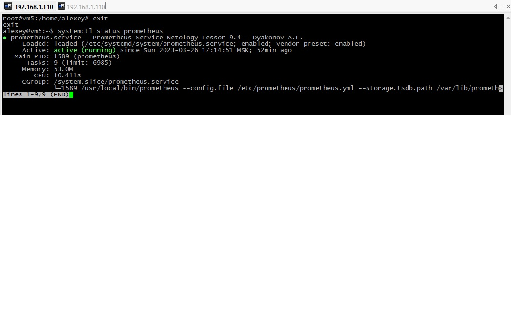
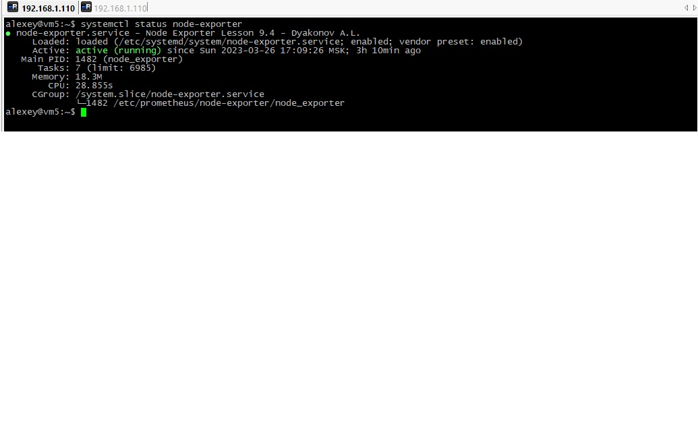
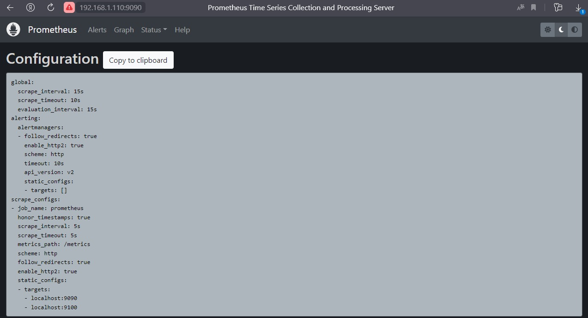
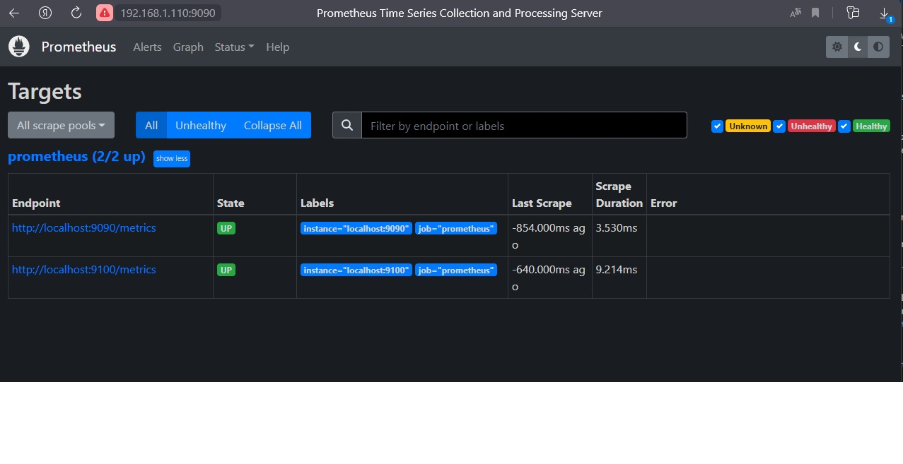
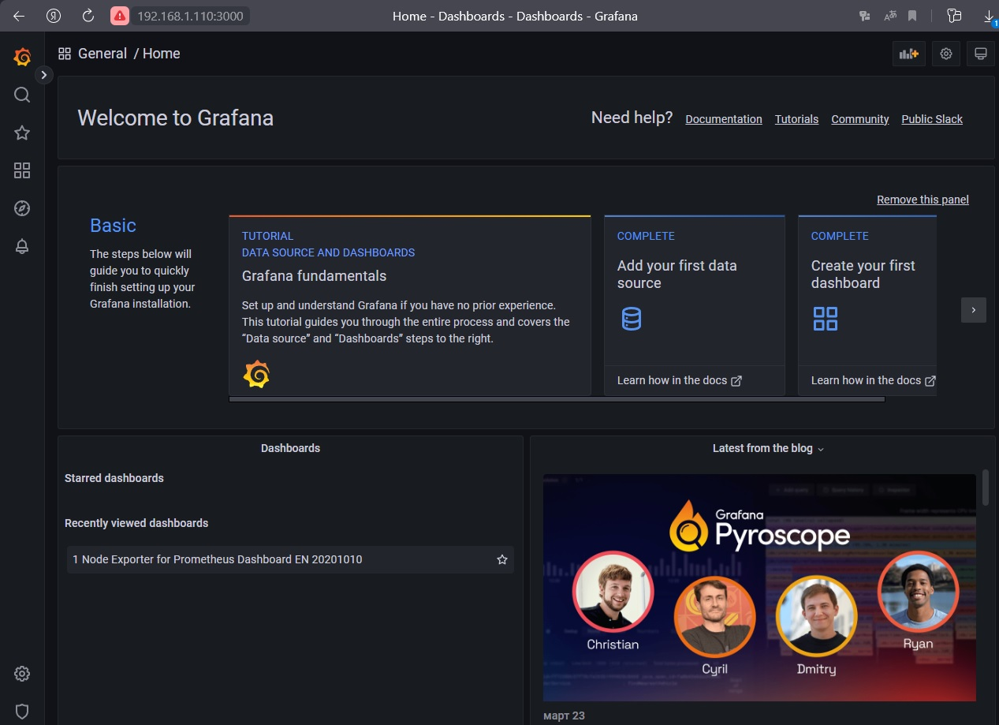
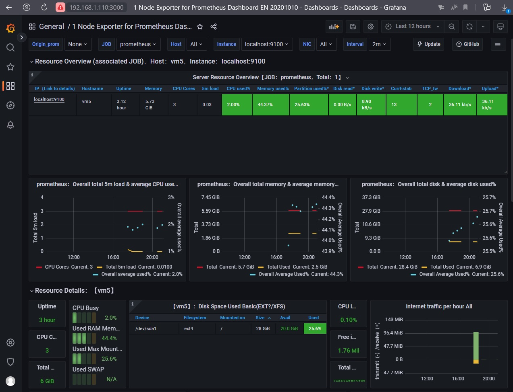

# Домашнее задание к занятию "`9.4 «Prometheus»`" - `Дьяконов Алексей`

### Задание 1. Установка Prometheus (по умолчанию порт 9090).

- 1. ` Создаём пользователя: `

    sudo useradd --no-create-home --shell /bin/false prometheus

- 2. ` Скачиваем последнюю версию с https://github.com/prometheus/prometheus/releases/ `

    wget https://github.com/prometheus/prometheus/releases/download/v2.43.0%2Bstringlabels/prometheus-2.43.0+stringlabels.linux-amd64.tar.gz

- 3. `Распаковываем и копируем в необходимые директории`

    tar xvfz prometheus-2.43.0+stringlabels.linux-amd64.tar.gz 
    cd prometheus-2.43.0+stringlabels.linux-amd64
    mkdir /etc/prometheus
    mkdir /var/lib/prometheus
    cp ./prometheus promtool /usr/local/bin/
    cp -R ./console_libraries /etc/prometheus
    cp -R ./consoles /etc/prometheus
    cp ./prometheus.yml /etc/prometheus

- 4. `Назначаем права`

    chown -R prometheus:prometheus /etc/prometheus /var/lib/prometheus
    chown prometheus:prometheus /usr/local/bin/prometheus
    chown prometheus:prometheus /usr/local/bin/promtool

- 5. `Запускаем и проверяем (одна команда ! не забыть ctrl+c)`

    /usr/local/bin/prometheus --config.file /etc/prometheus/prometheus.yml --storage.tsdb.path /var/lib/prometheus/ --web.console.templates=/etc/prometheus/consoles --web.console.libraries=/etc/prometheus/console_libraries 

- 6. `Создаём сервис`

    nano /etc/systemd/system/prometheus.service

    [Unit]
    Description=Prometheus Service Netology Lesson 9.4 - Dyakonov A.L.
    After=network.target
    [Service]
    User=prometheus
    Group=prometheus
    Type=simple
    ExecStart=/usr/local/bin/prometheus \
    --config.file /etc/prometheus/prometheus.yml \
    --storage.tsdb.path /var/lib/prometheus/ \
    --web.console.templates=/etc/prometheus/consoles \
    --web.console.libraries=/etc/prometheus/console_libraries
    ExecReload=/bin/kill -HUP $MAINPID Restart=on-failure
    [Install]
    WantedBy=multi-user.target

- 7. `Назначаем права`

    chown -R prometheus:prometheus /var/lib/prometheus

- 8. `Запускаем сервис`

    sudo systemctl enable prometheus
    sudo systemctl start prometheus
    sudo systemctl status prometheus

-

### Задание 2. Установка Node Exporter (порт 9100).

- 1. `Скачиваем и разархивируем архив`

    wget https://github.com/prometheus/node_exporter/releases/download/v1.4.0/node_exporter-1.4.0.linux-amd64.tar.gz
    tar xvfz node_exporter-*.*-amd64.tar.gz

- 2. `копируем Node Explorer в папку Prometheus`

    mkdir /etc/prometheus/node-exporter
    cp ./* /etc/prometheus/node-exporter

- 3. `Назначаем права`

    chown -R prometheus:prometheus /etc/prometheus/node-exporter/

- 4. `Создаём сервис`

    nano /etc/systemd/system/node-exporter.service 

   [Unit]
    Description=Node Exporter Lesson 9.4 - Dyakonov A.L.
    After=network.target
    [Service]
    User=prometheus
    Group=prometheus
    Type=simple
    ExecStart=/etc/prometheus/node-exporter/node_exporter
    [Install]
    WantedBy=multi-user.target
 
- 5. `Запускаем сервис`

    sudo systemctl enable node-exporter
    sudo systemctl start node-exporter
    sudo systemctl status node-exporter

-

### Задание 3. Подключение Node Exporter к Prometheus.

- 1. `Правим конфиг Prometeus`

    nano /etc/prometheus/prometheus.yml
    scrape_configs:
     — job_name: 'prometheus'
      scrape_interval: 5s
      static_configs:
       — targets: ['localhost:9090', 'localhost:9100']

    systemctl restart prometheus

-
-

### Задание 4. Установка Grafana (порт 3000).

`Скачиваем и устанавливаем пакет`

    wget https://dl.grafana.com/oss/release/grafana_9.2.4_amd64.deb
    dpkg -i grafana_9.2.4_amd64.deb

    systemctl enable grafana-server
    systemctl start grafana-server
    systemctl status grafana-server

`Логин и пароль: admin \ admin`

-

### Задание 5. Интеграция Grafana  и Prometheus.

- 1. `Configuration > Data Sources > Add data sourcе`
- 2. `Выбираем Prometheus`
- 3. `Вводим url: http://localhost:9090`
- 4. `Dashboards >  +Import > вводим ID дашборда(с сайта https://grafana.com/grafana/dashboards/1860-node-exporter-full/)`
- 5. `В списке VictoriaMetrics выбираем Prometheus > Import`

-